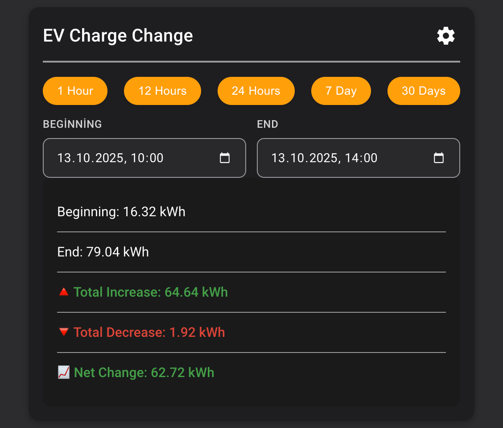

# Trend Analysis Card for Home Assistant



## 🚀 Installation

### HACS Installation (Recommended)

[](https://my.home-assistant.io/redirect/hacs_repository/?owner=Riscue&repository=trend-analysis-card)

### Manual Installation

1. Copy the `dist/trend-analysis-card.js` file into your Home Assistant `www` directory.
2. Add the card as a Lovelace resource:

    ```yaml
    url: /local/trend-analysis-card.js
    type: module
    ```

3. Add the configuration below to your dashboard or view.

---

## 📋 Basic Usage

```yaml
type: custom:trend-analysis-card
header: Change of My Sensor
entity: sensor.my_sensor
preset: 24
showSettings: false
showPresets: true
showDatePickers: false
```

---

| Name                | Type      | Required | Default              | Description                                                                                                          |
|---------------------|-----------|----------|----------------------|----------------------------------------------------------------------------------------------------------------------|
| **entity**          | `string`  | ❌ No     | -                    | The entity ID of the sensor to analyze (e.g. `sensor.energy_usage`). If empty an entity must be selected from search |
| **header**          | `string`  | ❌ No     | entity.friendly_name | Card title displayed in the header.                                                                                  |
| **preset**          | `number`  | ❌ No     | `24`                 | Default preset range in hours (e.g. `24`, `168` for 7 days).                                                         |
| **showSettings**    | `boolean` | ❌ No     | `true`               | Whether to show a settings button.                                                                                   |
| **showPresets**     | `boolean` | ❌ No     | `true`               | Whether to display quick range selection buttons (24h, 7d, 30d).                                                     |
| **showDatePickers** | `boolean` | ❌ No     | `true`               | Whether to display the date range picker for manual selection.                                                       |

---

## License

MIT © [Riscue][riscue]

[riscue]: https://github.com/riscue
